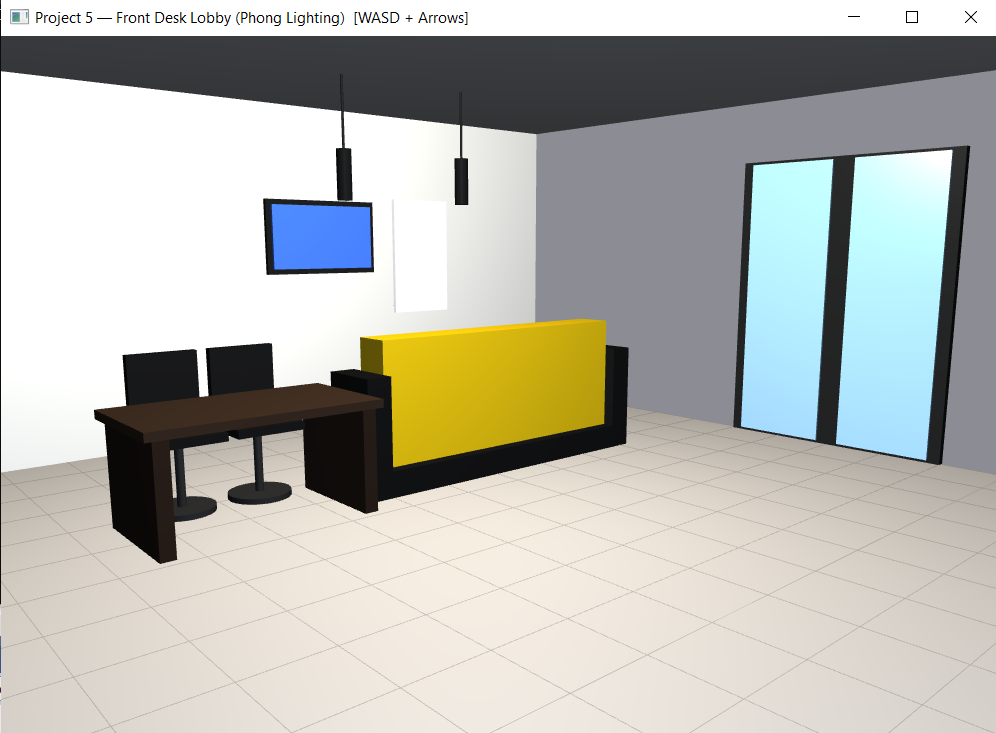

# Front Desk Lobby Scene — OpenGL

**Author:** Kian Knudegaard  
**Course:** [Course Name and Number]  
**Project:** Project 4 — 3D Scene Rendering  

---

## Description

A 3D rendering of an apartment building front desk lobby scene built with OpenGL 3.3 Core Profile and C++17. The scene contains 12 objects rendered using scaled unit cubes and cylinders, a free-moving virtual camera, and solid colour shading.

---

## Scene Objects

| # | Object | Primitives | Colour |
|---|---|---|---|
| 1 | Floor | Scaled cube | Grey tile |
| 2 | Ceiling | Scaled cube | Off-white |
| 3 | Back wall | Scaled cube | Light beige |
| 4 | Dark accent wall | Scaled cube | Dark wood |
| 5 | Counter front panel | Scaled cube | Yellow |
| 6 | Counter top | Scaled cube | Light grey |
| 7 | Counter base plinth | Scaled cube | Dark brown |
| 8 | Work desk | 2 scaled cubes | Dark wood |
| 9 | Wall-mounted TV | 2 scaled cubes | Black bezel / blue screen |
| 10 | Whiteboard | Scaled cube | White |
| 11 | Pendant lights ×2 | Cylinders | Black |
| 12 | Office chairs ×2 | Cubes + cylinders | Black |

---

## Controls

| Key | Action |
|---|---|
| `W` / `S` | Move forward / backward |
| `A` / `D` | Strafe left / right |
| `LEFT` / `RIGHT` | Rotate camera (yaw) |
| `UP` / `DOWN` | Tilt camera (pitch) |
| `ESC` | Quit |

---

## Build Instructions

### Requirements
- CMake 3.20+
- vcpkg with `glfw3`, `glad`, `glm` installed
- C++17 compiler (MSVC 2022 recommended on Windows)
- OpenGL 3.3+ capable GPU

### Steps

```bash
# 1. Install vcpkg packages (first time only)
cd C:/Users/<you>/vcpkg
.\vcpkg install glfw3 glad glm

# 2. Configure
cmake -B build -S . -DCMAKE_TOOLCHAIN_FILE="C:/Users/<you>/vcpkg/scripts/buildsystems/vcpkg.cmake"

# 3. Build
cmake --build build --config Debug

# 4. Run
./build/Debug/Scene.exe
```

Or open the folder in **Visual Studio 2022** — it detects `CMakePresets.json` automatically.

---

## Project Executables

| Executable | Description |
|---|---|
| `Scene.exe` | Full front desk lobby scene (Project 4) |
| `ReceptionDesk.exe` | Isolated reception counter (Lab) |
| `Pyramids.exe` | Three pyramids, three camera views (Lab) |
| `Mesh.exe` | Sine wave surface mesh f(x,z)=sin(x)·cos(z) (Lab) |

---

## Screenshots




---

##Project 5 Additions
At a very basic level, project 5 introduced shaders and much better lighting to the scene from project 4. For further specific detail, check the requirements and the project 5 submission document

## AI Assistance Disclosure

Portions of this project were developed with the assistance of an AI tool (Claude by Anthropic). Scene design and OpenGL pipeline understanding are the author's own. AI assistance was used for boilerplate code structure and documentation formatting.
